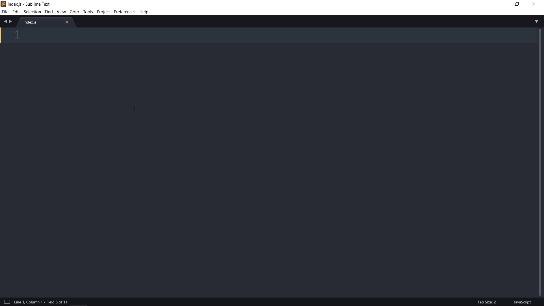

# Javascript Snippets For Sublime Text

---

### List of Snippets add to this Package

| SI.No | tabTrigger | Description       |
| ----- | ---------- | ----------------- |
| 1.    | `fn`       | Function          |
| 2.    | `const`    | Declare Const     |
| 3.    | `var`      | Declare Var       |
| 4.    | `gebi`     | Get Element By ID |

#### Expansion of Snippets

1. Snippet : `fn`

```js
function function_name(argument) {
	//body ...
}
```

2. Snippet: `const`

```js
const constName = value;
```

3. Snippet: `var`

```js
var varName = value;
```

4. Snippet:`gebi`

```js
getElementById("");
```

### Demo


